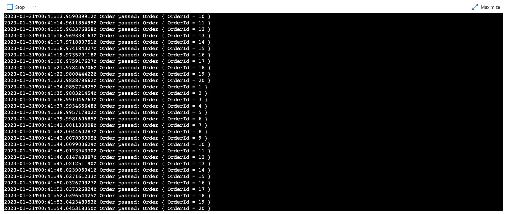
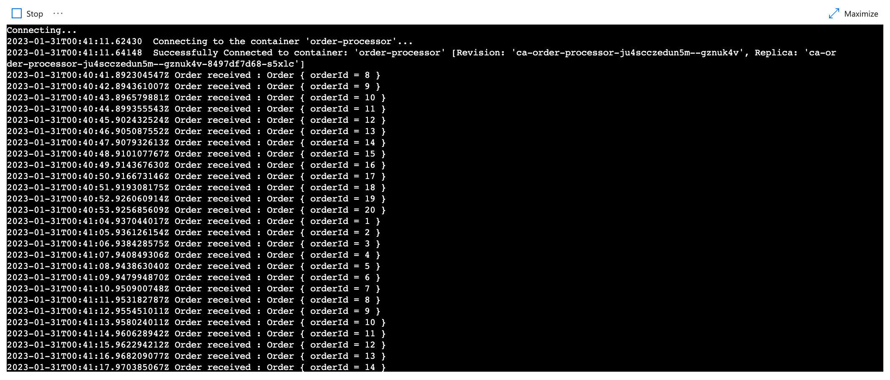

<!-- YAML front-matter schema: https://review.learn.microsoft.com/en-us/help/contribute/samples/process/onboarding?branch=main#supported-metadata-fields-for-readmemd -->

# Microservice communication using service invoke (sync)

In this quickstart, you'll create two microservices that communicate using Dapr's Service Invocation API. The Service Invocation API enables your applications to communicate reliably and securely by leveraging auto-mTLS and built-in retries.


Visit [this](https://docs.dapr.io/developing-applications/building-blocks/service-invocation/) link for more information about Dapr and Service Invocation.

# Run and develop locally

### Run the order-processor service (callee) with Dapr

2. Open a new terminal window, change directories to `./order-processor` and run: 

```bash
cd order-processor
dotnet restore
dotnet build
```

3. Run the order-processor service (callee) with Dapr: 

```bash
dapr run --app-port 7001 --app-id order-processor --app-protocol http --dapr-http-port 3501 -- dotnet run
```

### Run the checkout service (caller) with Dapr

2. Open a new terminal window, change directories to `./checkout` and run: 

```bash
cd checkout
dotnet restore
dotnet build
```

3. Run the checkout service (callee) with Dapr: 

```bash
dapr run  --app-id checkout --app-protocol http --dapr-http-port 3500 -- dotnet run
```

4. Expected output:
In both terminals, you'll see orders passed and orders received. Service invocation requests are made from the checkout service to the order-processor service: 

Output from the checkout service:
```bash
== APP == Order passed: {"orderId":1}
== APP == Order passed: {"orderId":2}
== APP == Order passed: {"orderId":3}
== APP == Order passed: {"orderId":4}
```

Output from the order-processor service:
```bash
== APP == Order received: { orderId: 1 }
== APP == Order received: { orderId: 2 }
== APP == Order received: { orderId: 3 }
== APP == Order received: { orderId: 4 }
```

# Deploy to Azure (Azure Container Apps)
Deploy to Azure for dev-test

NOTE: make sure you have Azure Dev CLI pre-reqs [here](https://learn.microsoft.com/en-us/azure/developer/azure-developer-cli/install-azd?tabs=winget-windows%2Cbrew-mac%2Cscript-linux&pivots=os-windows) and are on version 0.9.0-beta.3 or greater.

1. Run the following command to initialize the project. 

```bash
azd init --template https://github.com/Azure-Samples/svc-invoke-dapr-csharp
``` 

This command will clone the code to your current folder and prompt you for the following information:

- `Environment Name`: This will be used as a prefix for the resource group that will be created to hold all Azure resources. This name should be unique within your Azure subscription.

2. Run the following command to package a deployable copy of your application, provision the template's infrastructure to Azure and also deploy the application code to those newly provisioned resources.

```bash
azd up
```

This command will prompt you for the following information:
- `Azure Location`: The Azure location where your resources will be deployed.
- `Azure Subscription`: The Azure Subscription where your resources will be deployed.

> NOTE: This may take a while to complete as it executes three commands: `azd package` (packages a deployable copy of your application),`azd provision` (provisions Azure resources), and `azd deploy` (deploys application code). You will see a progress indicator as it packages, provisions and deploys your application.

3. Confirm the deployment is susccessful:

Navigate to the Container App resources for both the Checkout and Order-Processor services. Locate the `Log stream` and confirm the app container is logging each request successfully. 




